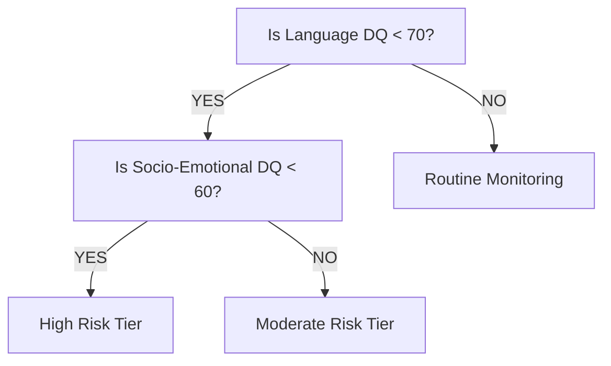
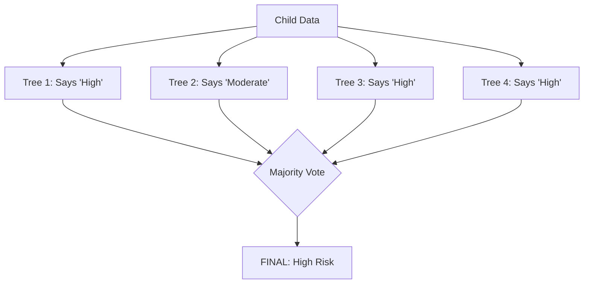
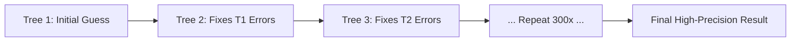
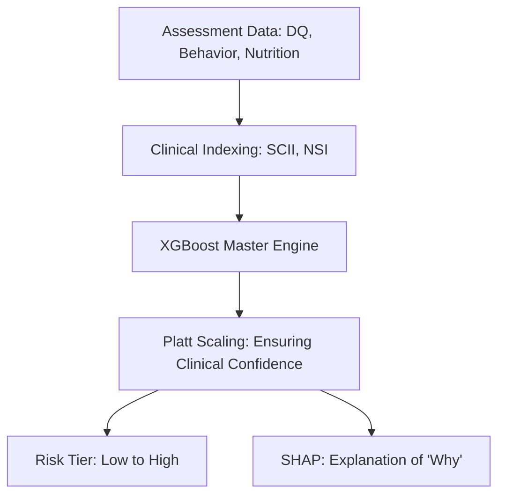

# RISE - Clinical AI Explained
## A Guide for Clinicians & Program Managers

---

### 📖 Glossary for Non-Technical Leaders
Before we dive into the models, let's simplify the language:
- **Model**: A "digital brain" trained to recognize patterns.
- **Algorithm**: The set of rules the model follows (like a recipe).
- **Features**: The clinical data we feed the model (DQ scores, behavioral flags).
- **Training**: The process where the model looks at thousands of historical cases to learn what "High Risk" looks like.

---

### 🏛️ The Three Stages of AI Evolution in RISE

We have evolved through three levels of "intelligence" to reach the current high-accuracy system.

---

### 🟢 Level 1: The Decision Tree (The Individual)
**Definition**: A Decision Tree is a simple flowchart that asks "Yes/No" questions to reach a conclusion.

**How it works**: It starts at a "root" question and branches out until it reaches a final risk category.

**Diagram**:

- **Metaphor**: A single doctor following a standard triage protocol.
- **Strength**: Very easy to understand.
- **Weakness**: Too simple. It can be "tricked" by unusual cases that don't fit the standard flowchart.

---

### 🟡 Level 2: Random Forest (The Committee)
**Definition**: Instead of one tree, we build a "Forest" of hundreds of different trees. 

**How it works**: Each tree is slightly different. They all look at the child's data and "vote" on the risk level. The majority wins.

**Diagram**:

- **Metaphor**: A board of 100 specialists discussing a case. Even if one doctor is wrong, the other 99 will likely get it right.
- **Strength**: Much more stable and accurate than a single tree.
- **Weakness**: It treats all trees as equal, even if some are better than others.

---

### 🔴 Level 3: XGBoost (The Master Expert)
**Definition**: This is our current "Gold Standard" engine. It stands for **Extreme Gradient Boosting**.

**How it works**: Instead of trees working in parallel (like Level 2), they work in **sequence**. Each new tree is built specifically to **fix the mistakes** of the previous trees.

**The "Error-Fixer" Loop**:
1.  **Tree 1** makes a quick guess.
2.  **Tree 2** looks at where Tree 1 was wrong and focuses only on those errors.
3.  **Tree 3** fixes the remaining errors from Tree 2.
4.  This continues for 300+ steps until the error is almost zero.

**Diagram**:

- **Metaphor**: An expert mentor and an apprentice. The apprentice makes a mistake, the mentor corrects it. The apprentice learns, and then the next lesson focuses on the new, smaller mistakes.
- **Strength**: Unmatched accuracy (**95%+**). It is "Extreme" because it is optimized to be incredibly fast and precise.

---

### 📊 The End-to-End RISE Data Flow
This is how a child's information travels through the system today.

---

### 🔍 Why This Matters for You
By using **XGBoost**, RISE provides:
1.  **Objectivity**: No human bias; the model looks only at the clinical evidence.
2.  **Early Action**: It can detect subtle patterns that a single person might miss.
3.  **Transparency**: Through our **SHAP** feature, the "Master Expert" explains exactly why it reached its conclusion (e.g., "Language Delay was the biggest factor").

**Summary**: We moved from a simple flowchart (Decision Tree) to a committee (Random Forest) to a sequential expert system (XGBoost) to ensure your program has the most accurate early detection system possible.
