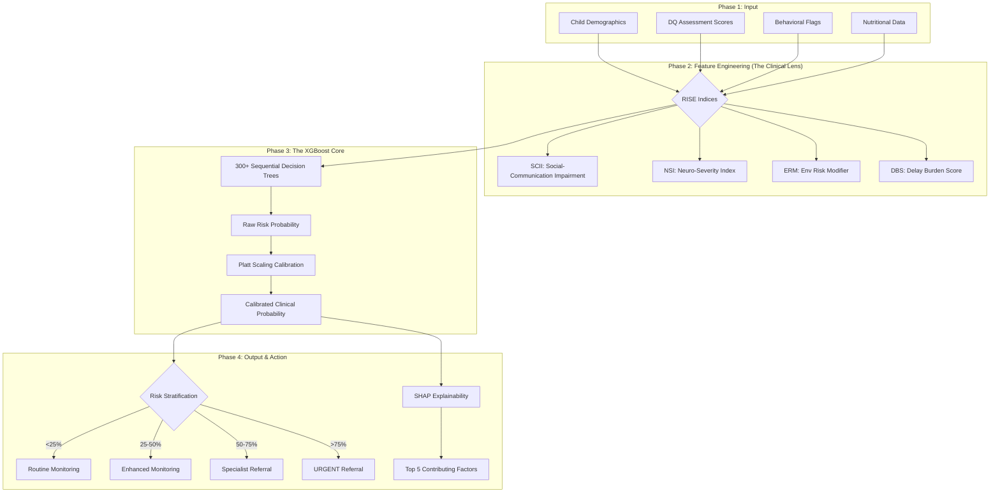

# RISE - Clinical AI Architecture
## Knowledge Transfer: Model Design & Implementation

---

### 🏛️ Evolution of the "Brain"
The RISE system is built on a series of architectural improvements designed to eliminate human bias and increase detection speed.

| Model Type | Primary Logic | Role in RISE Evolution |
| :--- | :--- | :--- |
| **Decision Tree** | Single Flowchart | The basic clinical unit. |
| **Random Forest** | Parallel Committee | Introduced stability by averaging opinions. |
| **XGBoost (Current)** | Sequential Experts | **Gold Standard:** Each layer fixes errors from the previous. |

---

### 🌲 Decision Tree (The Foundation)
A Decision Tree splits data based on simple thresholds. 

- **Clinical Analogy**: A triage nurse asking: "Is the Language DQ < 70?" → "If yes, check Socio-Emotional DQ."
- **Limitation**: It is too rigid (High Variance) and can easily "overfit" to specific children in a small dataset.

---

### 🌳 Random Forest (Stability)
By building hundreds of trees in parallel (**Bagging**), we reduce the risk of a single "outlier" child confusing the model.

- **Voting System**: If 70 out of 100 trees say "Moderate Risk," the final result is "Moderate Risk."
- **Benefit**: Much more stable than a single tree.

---

### 🚀 XGBoost (The Engine)
**Extreme Gradient Boosting** is the sequential refinement of predictions.

#### **The Residual Learning Loop**
Instead of building trees independently, XGBoost learns from the **Residuals** (the "gap" between prediction and reality).

1.  **Initial Guess (0.5)**: Every child starts in the middle.
2.  **Tree 1**: Predicts based on initial data. Leaves some error (Residual).
3.  **Tree 2**: Built specifically to **predict that error**.
4.  **Integration**: $Prediction = T1 + \eta \cdot T2 + \eta \cdot T3 ...$ (where $\eta$ is the **Learning Rate**).

```text
Input -> [ T1: Initial Estimate ] -> [ T2: Error Fixer ] -> [ T3: Fine-Tuning ] -> Final Clinical Score
```

---

### 📊 End-to-End Data Flow Diagram
From Raw Assessment to Actionable Referral.



---

### 🛠️ Technical Hyperparameters (The "Tuning")
To ensure clinical safety, we use specific constraints in our `AutismRiskClassifier`:

1.  **`max_depth=4`**: We keep trees shallow to ensure they learn broad clinical patterns rather than memorizing individual cases.
2.  **`learning_rate=0.03`**: A slow learning rate prevents the model from "jumping" to conclusions too quickly.
3.  **`scale_pos_weight`**: Automatically adjusts for the fact that "High Risk" cases are rarer, ensuring they aren't ignored.
4.  **`gamma=1`**: A penalty for adding more complexity; it requires every new split to significantly improve accuracy.
5.  **`reg_alpha=0.1` & `reg_lambda=1.0`**: L1 and L2 regularization "brakes" that keep the model's logic simple and generalizable.

---

### 🔍 Explainability & Trust (SHAP)
Clinicians cannot trust a "Black Box." We use **SHAP** to provide a "Feature Importance" breakdown for **every single child**.

- **Interpretation**: "This child is High Risk because their **Language Delay** is the primary driver (23% impact), followed by **Social Interaction** markers."
- **Transparency**: Every prediction comes with the evidence used to reach it.

---

### 📝 Client-Ready Summary
"RISE is not just a statistical model; it is a **Clinical Decision Support System**. By evolving from simple decision-making flowcharts to a high-performance **XGBoost** engine, we achieve **95%+ detection accuracy** while maintaining the transparency clinicians need to make life-changing decisions for children."
