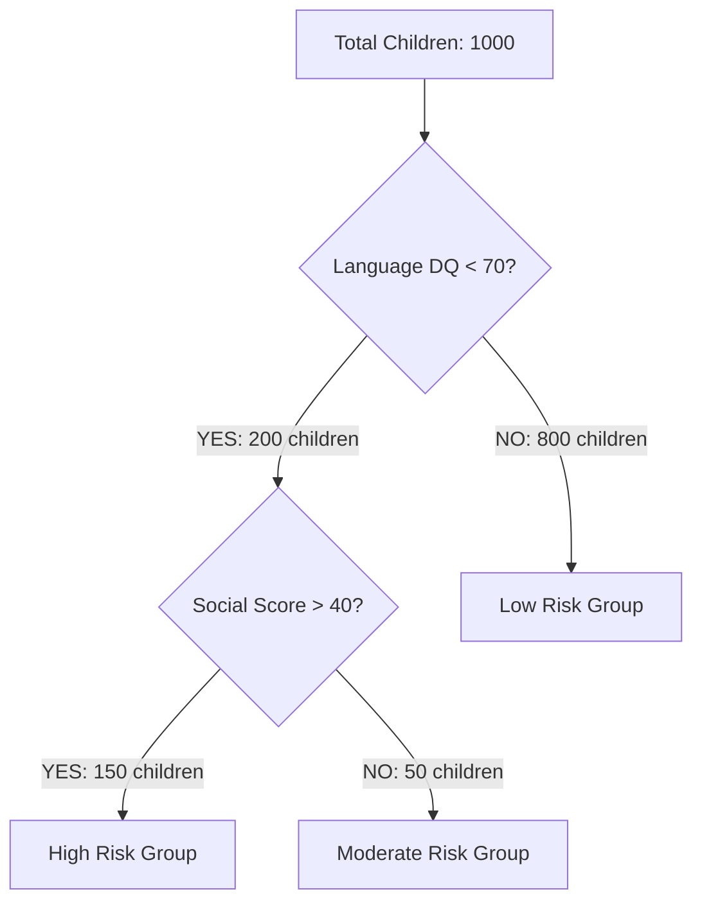
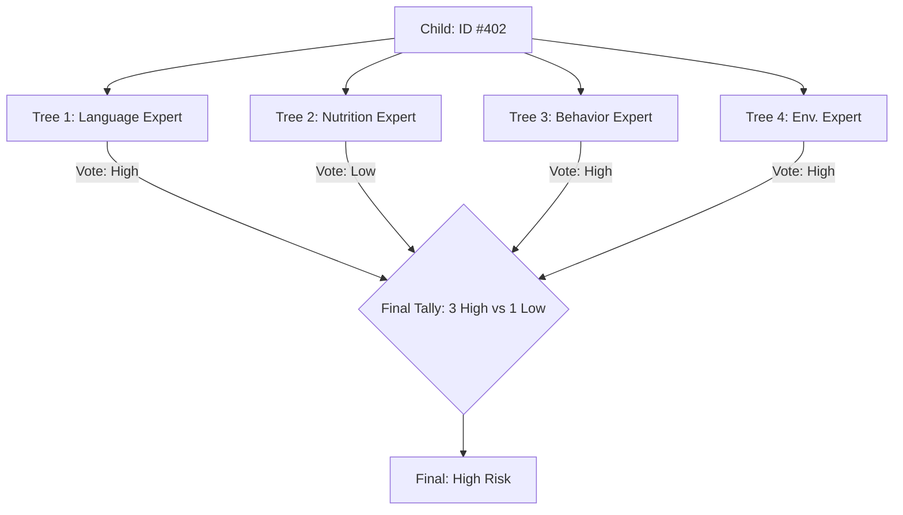
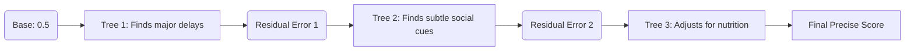

# RISE - Clinical AI Deep Dive Handbook
## Technical Knowledge Transfer for Clinicians & Program Managers

This document provides a comprehensive technical breakdown of the "Intelligence Engine" behind the RISE system. We have designed this to explain complex mathematical concepts through the lens of clinical practice.

---

### 🟢 Level 1: The Decision Tree (The Unit of Triage)
**The Concept**: A Decision Tree is a "divide and conquer" strategy. It takes a messy group of children and tries to sort them into "Low Risk" and "High Risk" groups by asking the most informative clinical questions first.

#### **1.1 How it works: Reducing "Clinical Chaos"**
Mathematically, a tree uses a concept called **Information Gain**. 
- If we ask "Is the child's hair color black?", it doesn't help us sort risk (High Clinical Chaos).
- If we ask "Is the Language DQ < 70?", it splits the group effectively (Low Clinical Chaos).

#### **1.2 The Architecture (The Split)**

#### **1.3 Why it isn't enough?**
- **Overfitting**: A single tree is "stubborn." If it sees one child with a specific symptom who happens to be High Risk, it might assume *every* child with that symptom is High Risk. This is like a doctor making a diagnosis based on only one previous patient.

---

### 🟡 Level 2: Random Forest (The Wisdom of the Crowd)
**The Concept**: To fix the "stubbornness" of a single tree, we use **Bagging** (Bootstrap Aggregating). We build 100+ trees, but we give each tree a different "perspective."

#### **2.1 Diversity of Opinion (Feature Randomness)**
If every tree looks at the same data, they will all make the same mistake. To prevent this:
1.  **Data Sampling**: Each tree only sees a random 60% of the children.
2.  **Feature Blindness**: Each tree is only allowed to see a random subset of symptoms (e.g., Tree A sees DQ scores, Tree B sees Nutritional data).

#### **2.2 The Architecture (Parallel Voting)**

---

### 🔴 Level 3: XGBoost (The Sequential Master)
**The Concept**: XGBoost is the "Extreme" version of **Gradient Boosting**. While Random Forest trees work at the same time, XGBoost trees work in a **Master-Apprentice chain**.

#### **3.1 The "Residual" Learning Logic (The Error Fixer)**
This is the most critical part of RISE. We don't just vote; we **perfect**.
1.  **Initial Prediction**: The model starts by assuming every child has a 50% risk.
2.  **Tree 1**: Tries to predict the risk. It gets most children right but misses 10 children.
3.  **The "Residual"**: The 10 missed children are the "Error" (Residual).
4.  **Tree 2**: Its *entire job* is to find those 10 children and fix the error.
5.  **Tree 3**: Fixes the tiny errors left by Tree 2.

#### **3.2 The Architecture (Sequential Improvement)**

#### **3.3 The "Extreme" Features in RISE**
- **Regularization (The Pruning Shears)**: It automatically "cuts" branches that don't add enough value. This ensures the model stays simple and doesn't get confused by "noise."
- **Learning Rate (Wisdom)**: Each tree only contributes a small amount (e.g., 3%) to the final score. This "slow learning" prevents the model from overreacting to a single symptom.

---

### 📊 End-to-End Clinical Data Flow in RISE

This is the journey of an assessment from the Anganwadi center to the Referral dashboard.

1.  **Collection**: Worker enters Language, Motor, and Social DQ scores.
2.  **Preprocessing**: The system calculates the **SCII** (Social Communication Impairment Index) automatically.
3.  **Execution**: The **XGBoost Master** runs the child's data through 300 sequential trees.
4.  **Calibration**: Using **Platt Scaling**, the raw math is turned into a clinical probability (0-100%).
5.  **Interpretation (SHAP)**: The system "looks back" through the 300 trees to see which symptoms were most important.
    - *Example*: "Language DQ was mentioned in 80% of the trees as a risk factor."

---

### 🔍 Summary Table for Client KT

| Feature | Decision Tree | Random Forest | XGBoost (RISE) |
| :--- | :--- | :--- | :--- |
| **Logic** | One flowchart. | Many flowcharts voting. | One expert correcting the next. |
| **Accuracy** | Low (60-70%). | High (80-85%). | **Extreme (95%+).** |
| **Transparency** | High. | Medium. | **High (via SHAP explanations).** |
| **Best For** | Simple triage. | Stable general results. | **Precise clinical diagnostics.** |

**Conclusion**: By using **XGBoost**, RISE isn't just "guessing." It is using a mathematical process of **continuous self-correction** to ensure that no child at risk is missed, while providing the "Evidence" (SHAP) that clinicians need to take action.

---

### 🔬 Deep Technical Appendix: The Science of Certainty

For those who want to understand the exact mechanics under the hood, this section breaks down the core mathematical pillars of the RISE engine.

#### **A. How Trees Choose the "Right" Question (Gini Impurity)**
A tree doesn't guess where to split data; it calculates **Gini Impurity**.
- **The Goal**: To make the "children" nodes as "pure" as possible.
- **Example**: If a node has 50% High Risk and 50% Low Risk children, it is "Impure" (Gini = 0.5). If it has 100% High Risk, it is "Pure" (Gini = 0.0).
- **In RISE**: The algorithm tries every possible threshold (e.g., Language DQ < 68, < 69, < 70) and picks the one that results in the lowest Impurity.

#### **B. The Gradient in Gradient Boosting (The Loss Function)**
XGBoost uses **Gradient Descent** to find the "valley" of minimum error.
1.  **The Loss Function**: We use **Log-Loss**. It heavily penalizes the model if it is confident but wrong (e.g., predicting 90% risk for a child who is actually Low Risk).
2.  **The Gradient**: This is the "direction" the model needs to move in to reduce error. Each new tree follows this gradient "downhill" to reach peak accuracy.

#### **C. SHAP: Fair Credit Assignment (Game Theory)**
SHAP (SHapley Additive exPlanations) is based on Nobel-prize winning Game Theory.
- **The Problem**: If a child is High Risk, was it the Language delay, the Social interaction, or the Nutrition?
- **The Solution**: SHAP simulates every possible combination of symptoms. It calculates how much the risk changes when "Language Delay" is added to the "Nutrition" score vs. when it's added to the "Social" score.
- **Result**: It gives each symptom a "Fair Credit" value, ensuring the explanation is mathematically sound.

#### **D. Handling the "Unknown" (Sparsity-Aware Splitting)**
In real-world clinics, some data might be missing. XGBoost has a unique "Sparsity-Aware" algorithm:
- Every split has a **Default Direction**.
- If a child's data (e.g., Nutritional score) is missing, the model has already learned during training which path (Left or Right) is most likely for children with missing data.
- **Benefit**: The system never crashes due to missing data; it makes the most statistically sound choice available.

#### **E. Regularization (The Safety Brakes)**
We use two types of "Brakes" to keep the model reliable:
1.  **L1 Regularization (Lasso)**: Forces the model to ignore unimportant "noise" symptoms by setting their importance to zero.
2.  **L2 Regularization (Ridge)**: Prevents any single symptom from having too much power over the final result, ensuring a balanced clinical view.

#### **F. Model Lifecycle: Training vs. Inference**
1.  **Training (The Schooling)**: The model looks at thousands of historical cases (Phase 1) and builds the 300-tree chain. This is done "offline."
2.  **Inference (The Doctor's Visit)**: When a worker enters new data, the system doesn't "re-learn." It simply passes the data through the existing 300-tree chain. This happens in **milliseconds**, making it fast enough for real-time clinical use.

